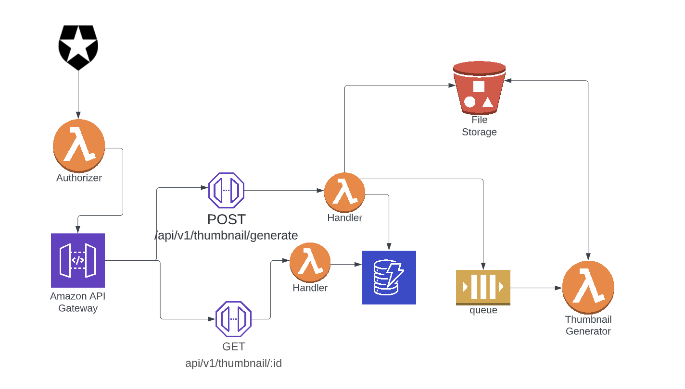

# PoC: Thumbnail Generator API

## Repo Organization

- `/lib` : All our infrastructure defined with cdk and typescript
- `/openapi` : Definitions of our api using openapi standard. this file is used for api gateway deployment.
- `/src/auth` : Lambda authorizer, usined for authorization in api gateway. This lambda validates token against Auth0 service.
- `/src/lambdas/api` : That is the place where api handlers code is located.
- `/src/lambdas/async` : There is a place for lambda that is usually triggered in async event. In this case is the lambda that is triggered by sqs to process the image.
- `/src/layers` : Pieces of reusable code used by lambdas.
- `/test` : This is where all tests are stored.
- `Dockerfile` : This file is used to create the lambda to process image files.

## Requirements | Stack

- CDKv2
- Typescript
- Nodejs
- Docker
- Jest

## Special requirements

In order to use `aws-cdk-lib/aws-lambda-nodejs` for bundling and transpiling you might need the following:

- Having docker running on your machine
- Enable experimental features on docker and restart docker daemon
- Logout from ECR in case you have your credentials saved. `docker logout public.ecr.aws`

## Useful commands

- `npm i`
- `npx cdk synth`
- `npx cdk deploy --all`
- `npm run test`

## Api Design

- `POST /api/v1/thumbnail/generate`
- `GET /api/v1/thumbnail/:requestId`

## Backend Architecture

## Persistence layer

For pesist the data we are going to use dynamo db with a table called thumbnail requests where partition key will be a request id generated. Besides that we plan to storage information of request status, insert date, modified date and thumbnail public urls when the image processing has finished.
